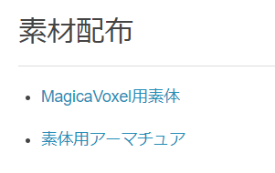
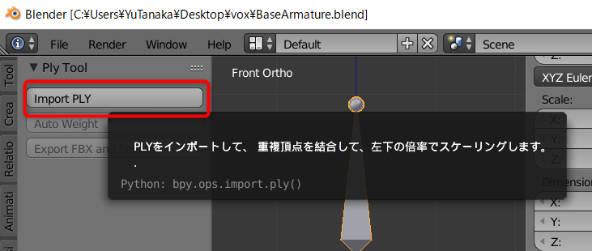
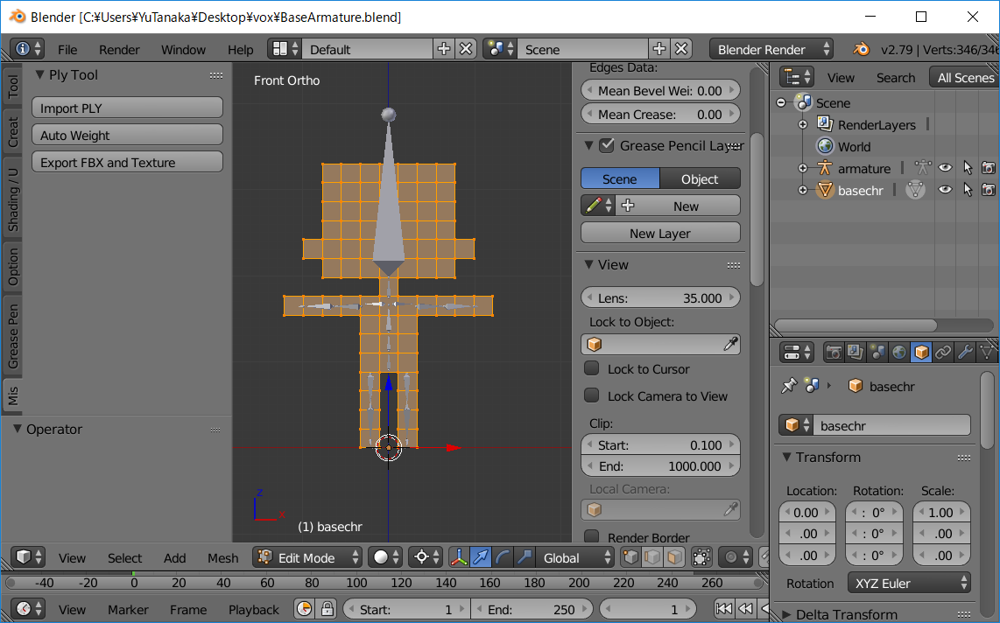
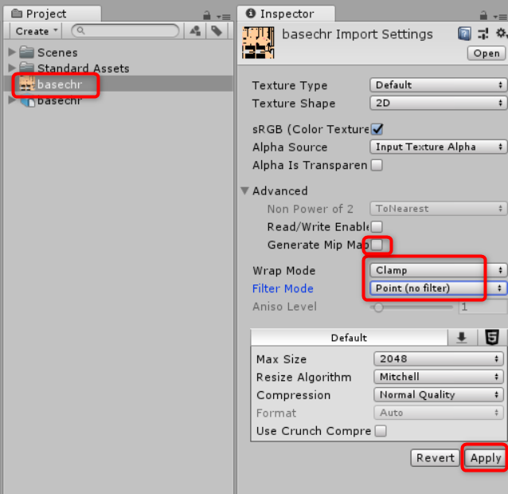
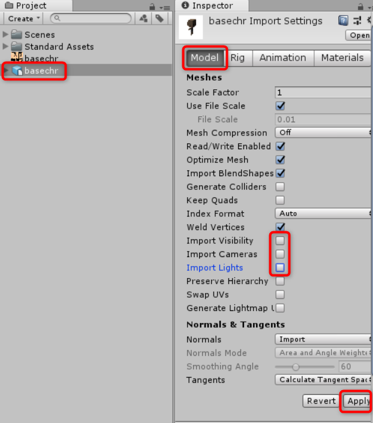
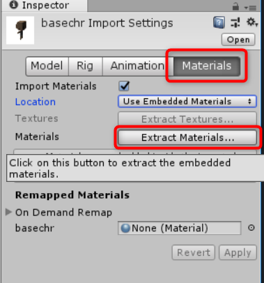

# ply2fbx-armature.py
**MagicaVoxel**で**PLY**形式で出力したボクセルのキャラクターにウェイトを設定して、Unityで簡単にアニメーションさせるためのBlender用のスクリプトです。

2通りの方法で、ウェイト設定をしたキャラクターを作ることができます。

- Blenderのみ利用する方法
  - だいし様の[MagicaVoxelで作ったプリキュアをUnityで動かす](https://github.dev7.jp/b/2015/12/15/precureadv20151213/)の記事で配布されているアーマチュアと素材を使って、ウェイト設定をして、FBXとPNGファイルをエクスポート
- Blenderとmixamoを利用
  - BlenderでエクスポートしたテクスチャーとFBXファイルをZIP圧縮して、[mixamo](https://www.mixamo.com/)にアップロードしてウェイト設定とアニメーション付けをする

# インストール
**Blender 2.79b**にインストールする手順です。Blenderはインストール済みとします。

- Blenderが起動していたら閉じておきます
- Blenderのインストールフォルダーを開いて、`scripts/startup`フォルダーを開きます
  - Windowsの場合、デフォルトのインストーす先は`C:\Program Files\Blender Foundation\Blender\2.79\`です

- [こちら](https://github.com/am1tanaka/ply2fbx/releases/download/v1.0.1/ply2fbx-armature.py)からダウンロードした`ply2fbx-armature.py`を、`startup`フォルダーにコピーします(管理者権限が必要かも知れません)

以上でインストール完了です。Blenderを起動すると、スクリプトが機能します。Miscタブが追加されて、3つのボタン(Import PLY, Auto Weight, Export FBX and Texture)が確認できればOKです。

> Add-onにするものかもですが、詳しくないのでとりあえず手っ取り早くStartupで起動することにしました。タブ名もデフォルトっぽい*Misc*のまま。気になるようでしたらMITライセンスですのでご自由に修正ください。プルリク歓迎！

# BlenderのみでヒューマノイドモデルのFBXとPNGを生成
だいし様の[MagicaVoxelで作ったプリキュアをUnityで動かす](https://github.dev7.jp/b/2015/12/15/precureadv20151213/)の記事から、**MagicaVoxel用素体**(`base.vox`)と**素体用アーマチュア**(`BaseArmature.blend`)をダウンロードしてください

## MagicaVoxelでキャラクター作り
- [MagicaVoxel](https://ephtracy.github.io/)を起動して、base.voxを読み込みます
- 記事に従ってキャラクターを作成します(手順を確認する場合はbase.voxのままで構いません)
- *Export* -> *ply*をクリックします

- 分かりやすい場所に任意のファイル名で保存します。ファイル名は半角英数のみ推奨(Unityで色々起きる可能性があるので)

以上でキャラクター完成です。

## アーマチュアとPLYの読み込み
ここからBlenderでの作業になります。必要なファイルを読み込みます。

- Blenderが起動していなければ起動します
- ダウンロードしてあった`BaseArmature.blend`をBlenderにドラッグ＆ドロップします

- 3D Viewの左のメニューから*Misc*タブをクリックします

- *Import PLY*ボタンをクリックします

- PLYファイルのフォルダーを設定して、読み込むファイルを選択して、*Import PLY*ボタンをクリックします

> デフォルトのPLYのサイズだと大きくなりすぎるので、アーマチュアとサイズが丁度良くなるようにサイズを0.22倍するようにしています。倍率は左下の*Scale*欄で設定できるので、読み込みと同時にサイズを調整したい場合は、値を変更してから*Import PLY*をクリックしてください。

PLYファイルのインポートが完了しました。

デフォルトのアーマチュアとbase.voxを使っていれば、最初から大きさと位置がぴったりと合います。

もし、大きさや位置がずれている場合は、この段階で調整してから次に進んでください。

## ウェイト設定
Blenderでウェイトを設定する場合は、メッシュとアーマチュアを階層して親子設定をするのですが、それらは*Auto Weight*ボタンを押せば完了です。

以下のように、*Outliner*で*armature*の子供にメッシュが設定されていれば成功です。

## エクスポート
PLYはテクスチャーを持たないので、Unityで色を付けるにはテクスチャーをベイクする必要があります。また、マテリアルの作成も必要です。**面倒なので自動化しました。**

- *Export FBX and Texture*ボタンをクリックします

- エクスポート先とファイル名を設定したら*Export FBX and Texture*ボタンをクリックすれば完了です

> デフォルトで生成されるテクスチャーのサイズは512x512ピクセルです。ボクセル数が多いと足りないかも知れないので、Unityで見た時に色がずれているような場合は、*Texture Width*と*Texture Height*を`1024`や`2048`に変更してみてください。
> ボクセル数が少なく、こんなに必要ないという場合は小さい値にしてください。不具合を避けるため、テクスチャーのサイズは2の累乗にしてください(よく分からない場合はいじらないでください)。

以上で完了です。出力先のフォルダーに、以下のように`fbx`と`png`の2つのファイルが出力されていれば成功です。

## Unityに読み込む
Unityに読み込んで動作テストしてみます。以下、前提です。

- Unity2018.1.3で確認(2017以降なら似たような操作でいけると思います)
- Standard Assetsインストール済み

Unityを起動して、確認用のプロジェクト(空のプロジェクトでよいです)を開きます。

- *Assets*メニューから*Import Package* -> *Characters*を選択して、*Import*します

- エクスポートした`.fbx`と`.png`を[Ctrl]キーを押しながら選択して、まとめてUnityのProjectビューにドロップします

**注意！！ FBXとPNGファイルを同時にドラッグ＆ドロップしないとテクスチャーが貼られないので気を付けてください！！**

- Projectビューで読み込んだPNGを選択して、以下を設定します
  - *Generate Mip Map*のチェックを外す
    - 小さくした時に変な線が出ることがあるので
  - *Wrap Mode*を*Clamp*に設定
    - 画像端のにじみ防止
  - *Filter Mode*を*Point(no filter)に設定
    - にじみ防止
  - 以上できたら、*Apply*ボタンをクリック

- Projectビューで読み込んだモデルを選択します
- *Model*について、以下を設定します
  - *Import Visibility*, *Import Cameras*, *Import Lights*のチェックを外す
    - くっついてませんが念のため
  - 設定したら*Apply*ボタンをクリック

- *Rig*について、以下を設定します
  - *Animation Type*を*Humanoid*に変更します
  - *Apply*ボタンをクリックします

これで、*Configure...*の左にチェックが表示されれば成功です。これをやらないと、設定したアーマチュアなどの設定が反映されないので重要な設定です。

マテリアルを取り出します。

- *Materials*について、以下を設定します
  - *Extract Materials...*ボタンをクリックします

- 保存先のフォルダーを選択します。*Materials*フォルダーを作成して、そこを選択するとよいでしょう

キャラクターを作ります。

- *Hierarchy*ビューの*Create*をクリックして、*Craete Empty*で空のゲームオブジェクトを作成します

- 作成したオブジェクト名をキャラクターの名前などにするとよいでしょう(`Player`など)
- *Project*ビューからキャラクターのモデルをドラッグして、*Hierarchy*ビューに作成したゲームオブジェクトにドロップして、子供にします

- *Hierarchy*ビューにドロップしたモデルをクリックして選択して、*Inspector*ビューで以下を確認＆設定します
  - *Transform*の*Position*・・・すべて`0`
  - *Rotation*・・・キャラクターを向かせたい方向(奥を向かせるのが一般的)
  - *Scale*・・・良さそうな大きさに調整

これでモデルが表示されます！

**注意！！　Rigidbodyをアタッチしたゲームオブジェクトの*Scale*は、必ず`1`にします。そうしないとRigidbodyの動作が破綻します。空のゲームオブジェクトを作って、モデルをその子供にしたのはモデルを調整しやすくするためです**

ただ、少し色が暗いので、マテリアルを調整しておきます。

- *Project*ビューで、保存したマテリアルを選択します

- *Inspector*ビューの*Albedo*の右の白い四角をクリックしてカラーパネルを表示したら、色を真っ白にして、*x*で閉じます

アニメーションを設定して、動かして見ましょう。

- *Hierarchy*ビューからキャラクターモデルを選択しておきます

- *Project*ビューで、*Standard Assets* -> *Characters* -> *ThirdPersonCharacter* -> *Animator*の左の三角をクリックして開きます

- *ThirdPersonAnimatorController*をドラッグして、*Inspector*ビューの*Controller*欄にドロップします
- テスト時に動かれると面倒なので、*Apply Root Motion*のチェックを外しておきます

- *Project*ビューで*ThirdPersonAnimatorController*をダブルクリックします

- *Animator*ウィンドウが表示されるので、左にある*Parameters*をクリックして、パラメーターを表示します

以上で準備完了です。Unityを*Play*してください。

*Animator*ウィンドウをクリックしてアクティブにしたら、パラメーターの値をいじってみてください。

走ったり、しゃがんだり、アニメーションすることが確認できれば成功です。

# 参考・関連URL
- [Blender](https://www.blender.org/)
- [MagicaVoxel](https://ephtracy.github.io/)
- [Blender 2.79.0 855d2955c49 - API documentation](https://docs.blender.org/api/2.79/)
- [だいし. MagicaVoxelで作ったプリキュアをUnityで動かす](https://github.dev7.jp/b/2015/12/15/precureadv20151213/)
