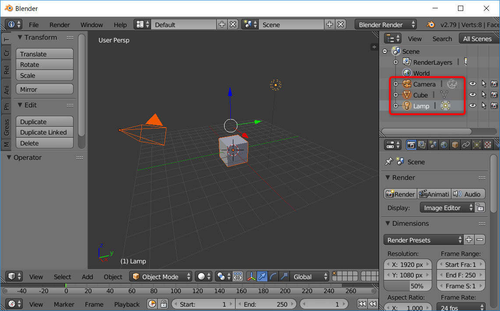
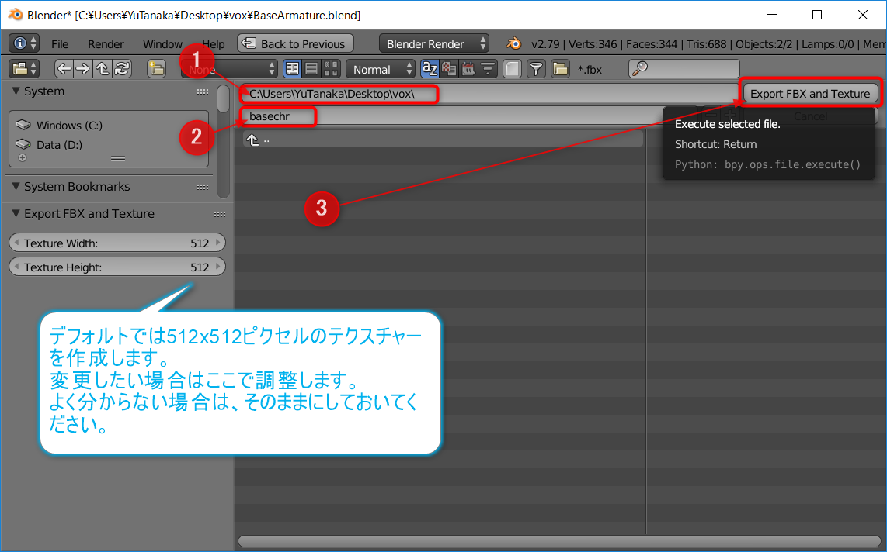
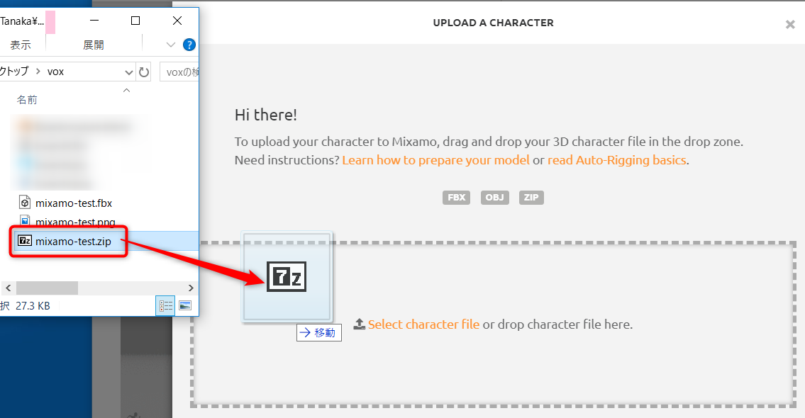
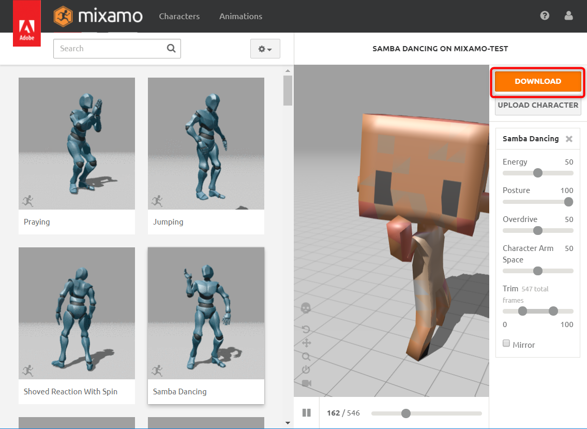

# Blenderでエクスポートしたメッシュをmixamoでアニメ付けする
キャラクターのサイズや体系がBaseArmatureと異なる場合などは、Adobe社が提供しているWebサービル[mixamo(ミクサモ)](https://www.mixamo.com/)の利用がオススメです。ここからは、mixamoでアニメーションを設定する手順です。

mixamoを利用するには、無料の会員登録(Sign up)が必要です。事前に登録してログインしておいてください。

## MagicaVoxelでキャラクターを作成する
この方法の場合は、`base.vox`から作業を開始する必要はありません。いわゆる[Tポーズ](https://www.google.co.jp/search?q=T%E3%83%9D%E3%83%BC%E3%82%BA&tbm=isch)になっていればOKです。

- キャラクターが完成したら、*Export* -> *ply*をクリックします

- 分かりやすい場所に任意のファイル名で保存します。ファイル名は半角英数のみ推奨(日本語や全角が混じったファイル名だとUnityで不具合が起きる可能性があります)

## BlenderでPLYをインポート
ここからはBlenderでの作業です。必要なファイルを読み込みます。

- Blenderが起動していなければ起動します。あるいは、*File*メニューから*New*を選択して、初期状態にします
- 既存の*Camera*, *Cube*, *Lamp*全て不要なので、[Shift]キーを押しながらクリックして3つとも選択します

- エディター上にマウスカーソルを移動させて、[Delete]キーを押して表示されるポップアップの*Delete*をクリックして、選択していたものを削除します

- 3D Viewの左のメニューで*Misc*タブをクリックして選択して、*Import PLY*ボタンをクリックします

- PLYファイルを保存したフォルダーを設定して、読み込むファイルを選択して、*Import PLY*ボタンをクリックします

> デフォルトのPLYのサイズだとUnityでは大きくなりすぎるので、0.22倍するようにしています。倍率は左下の*Scale*欄で設定できるので、読み込みと同時にサイズを調整したい場合は、値を変更してから*Import PLY*をクリックしてください。

PLYファイルのインポートが完了しました。

## FBXとPNGをエクスポート
mixamoを利用する場合は、Blenderでウェイト設定する必要はないので、このままFBXにエクスポートします。

- *Export FBX and Texture*ボタンをクリックします

- エクスポート先とファイル名を設定したら*Export FBX and Texture*ボタンをクリックすれば完了です

> デフォルトで生成されるテクスチャーのサイズは512x512ピクセルです。ボクセル数が多いと足りないかも知れないので、Unityで見た時に色がずれているような場合は、*Texture Width*と*Texture Height*を`1024`や`2048`に変更してみてください。

> ボクセル数が少なくて、もっと小さいテクスチャーで構わない場合は`128`や`256`にしてみてください。テクスチャーのサイズは2のテクスチャーのサイズは2の累乗である必要があります(よく分からない場合は、この設定はいじらないでください)。

以上で完了です。出力先のフォルダーに、以下のように`fbx`と`png`の2つのファイルが出力されていれば成功です。

## mixamoにモデルを読み込む
生成したFBXとPNGをmixamoにアップロードするには、ZIP圧縮しておく必要があります。

- `FBX`ファイルと`PNG`ファイルを選択して、右クリック -> *送る* -> *圧縮(zip形式)フォルダー*を選択します

FBXやPNGのあったフォルダーにZIPファイルが出来上がります。

- [mixamo](https://www.mixamo.com/)のページを開いて、ログインします
- *UPLOAD CHARACTER*ボタンをクリックします

- 先ほど作成した*ZIP*ファイルをドラッグして、mixamoの点線の枠内にドロップします

- モデルが表示されます。こちらを向いて立っているのが確認できたら*NEXT*をクリックします
  - 変な方向を向いていたら、左下の矢印をクリックして、以下の画像のように調整してから*NEXT*をクリックしてください

- 左下に並んでいる丸をドラッグして、キャラクターの該当する場所に設定します
  - 左右が分かりづらいので、以下を参考にしてみてください
  - (背景の色、変えられないだろうか...股の位置が見辛い...)

- 設定が完了したら*NEXT*をクリックします

キャラクターがくるくる回って、自動的にウェイトを設定する処理が行われます。完了を待ってください。

ウェイト設定が成功すると、アニメーションのデモが動きます。うまく動いていたら、*NEXT*ボタンをクリックします。

失敗していたら、*BACK*ボタンで戻って、間接の設定をし直してください。

色がおかしいのはUnityに持っていけば治るので放っておいて構いません。

以下の画面で*NEXT*をクリックしたら読み込み完了です。

## アニメの作成とエクスポート
アップロードとウェイト設定が完了したら、以下の画面に切り替わります。

左でモーションの選択、右のパラメーターで腕の広げ方や速度などのアニメーションの微調整ができます。使い方は他の記事を検索してください。ここではそのままデータをダウンロードします。

- 右上の*DOWNLOAD*ボタンをクリックします
- 以下の設定をして、*DOWNLOAD*します
  - *Format*は、*FBX for Unity(.fbx)*
  - *Frame per Second*は、*60*がゲームの場合はよいと思います
  - あとはデフォルトで大丈夫そうです
  - 以上設定したら、*DOWNLOAD*ボタンをクリックします

以上で、メッシュ、アニメーション、マテリアル、テクスチャーを埋め込んだFBXファイルをダウンロードできます。

あとは、Unityで動作確認をしましょう。

---

- mixamoを利用した場合
  - ダウンロードした`FBX`ファイルをドラッグして、Unityの*Project*ビューの読み込みたい場所にドロップします

- *Project*ビューで読み込んだモデルをクリックして選択します
- *Inspector*ビューで、Materialsタブを選択して、*Extract Textures...*をクリックして、適当なフォルダーを選択します

- 同様に、*Extract Materials...*をクリックして、適当なフォルダーを選択します

---
